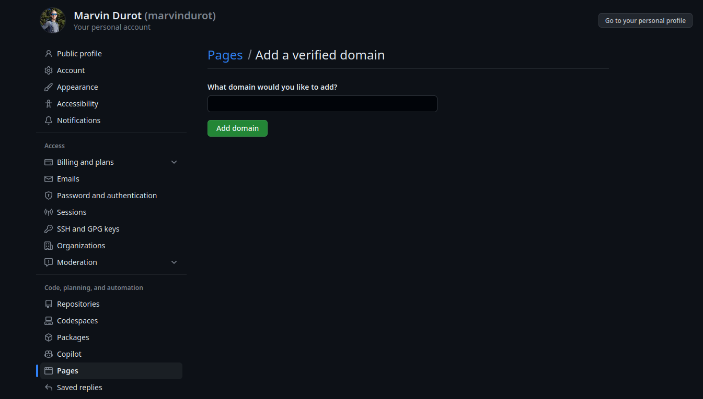
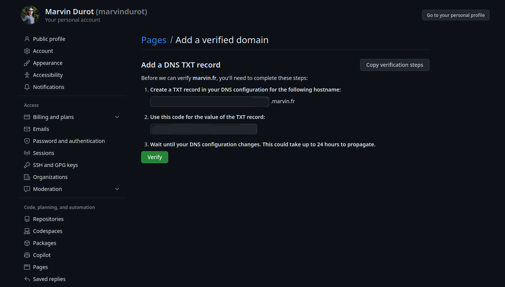
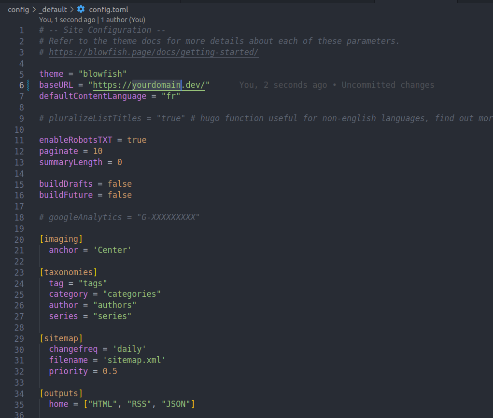
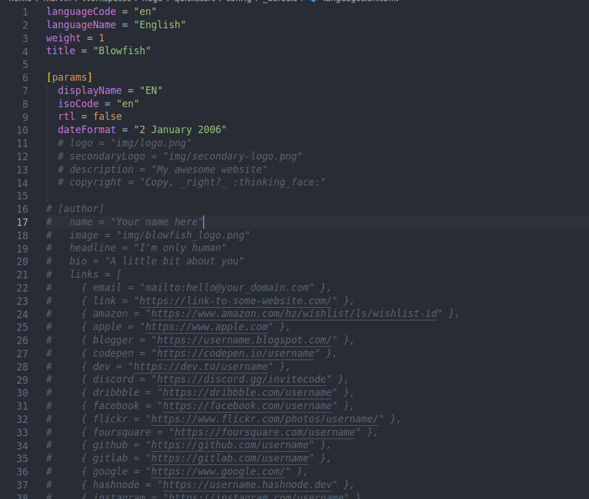

# Introduction

Aujourd'hui créer un blog n'a jamais été aussi simple. Il existe un nombre important de solutions existantes. Toutes n'ont pas les mêmes fonctionnalités mais l'une d'entre-elle a retenu mon attention pour créer ce blog : Hugo.

J'ai au moins 4 bonnes raisons :
1. C'est open source
2. Le rendu est statique
3. Tout est configurable et extensible

Le fait que le rendu soit statique n'est pas anodin, cela veut dire que :
1. Le contenu est hébergeable sur Github Pages
2. Les performances d'affichage sont supérieures à celle d'un site dynamique (ex: Wordpress)

Bien entenu cela implique aussi des contraintes (comme tout choix technique) :
1. Le site doit être généré à chaque déploiement : il n'est pas dynamique
2. Il faut installer le programme `hugo` pour générer le contenu final

Nous allons voir dans cet article comment initialiser, configurer et déployer votre blog en 10 minutes.

## Github Pages

Chaque utilisateur Github possède un site personnel, qu'il peut activer sur n'importe quel projet.

Si vous souhaitez comme moi, utiliser un nom de domaine personnalisé, il faut se rendre dans les paramètres de son compte, dans le menu Pages et ajouter votre domaine.



Vous êtes ensuite invité à saisir une nouvelle entrée DNS de type `TXT` chez votre fournisseur de domaine afin que Github puisse valider qu'il s'agit bien de votre domaine.



On commence par créer un nouveau projet vierge qu'on va ensuite cloner en local avec la commande `git clone`.

## Hugo

### Installation

Hugo est générateur de site statique écrit en Go. Il se dinstingue par ses performances de compilation (c'est rapide!) et sa flexibilité. En effet, tout ou presque est configurable et extensible.

Pour l'installer, on peut au choix :
- compiler les sources
- utiliser un gestionnaire de paquet

Vous l'aurez devinez, nous allons utiliser un gestionnaire de paquet 😅

Si vous êtes sous Linux :
```bash
sudo snap install hugo
```
Si vous êtes sous MacOS : 
```bash
brew install hugo
```

### Création du site

La création d'un nouveau projet se fait à l'aide de cette commande :
```bash
hugo new site my-blog
```
>Si vous êtes déjà dans le répertoire du projet, vous pouvez utiliser l'option `--force`.

Si tout se déroule correctement, vous devriez avoir la structure suivante en local :
```
.
├── archetypes ---------> les modèles de contenu
│   └── default.md -----> le modèle de contenu par défaut
├── assets -------------> les ressources utilisés dans des pipes
├── content ------------> le contenu du site
├── config -------------> les fichiers de configuration du site
├── data ---------------> données additionnelles utilisées par Hugo pour générer le site
├── hugo.toml ----------> la configuration générale du site
├── layouts ------------> les modèles de mise en forme
├── static -------------> les ressources statiques du site
└── themes -------------> les thèmes du site
```

Avant de pouvoir créer notre premier contenu, nous devons installer un thème.

### Installation du thème

La liste des thèmes disponibles est accessible à cette adresse : 
- https://themes.gohugo.io/

J'ai personnellement choisi le thème `blowfish` qui offre de nombreuses fonctionnalités out-the-box :
- Responsive design
- Plusieurs palettes de couleur
- Mode sombre
- Multilangues
- Intégration Firebase
- Optimisé pour le partage sur les réseaux sociaux
- ...

Mais ce que j'ai surtout préféré c'est sa documentation bien fournie.

L'installation d'un thème peut se faire avec l'installation d'un sous-module Git :
```bash
git submodule add -b main https://github.com/nunocoracao/blowfish.git themes/blowfish
```
Pour terminer, copiez les fichiers de configuration par défaut du thème :
```bash
cp -R themes/blowfish/config config
rm -f hugo.toml # ce fichier ne sert plus à rien
```
Ce sont grâce à ses fichiers que nous allons configurer l'ensemble du site :
- https://blowfish.page/docs/getting-started/#basic-configuration

> Par défaut la plupart des options ne sont pas activées mais commentées.

### Configuration du thème

Je vais maintenant vous expliquer comment modifier l'apparence et l'accessibilité de votre site web, ajouter des informations personnelles et activer le mode sombre (c'est à dire la fonctionnalité la plus importante!).

Commençons par ajouter une photo de profil à votre site. Créez un dossier appelé `assets` à la racine de votre projet. Choisissez une image de profil et placez-la dans le dossier `assets`. Dans la suite du guide, nous supposerons que l'image finale est nommée "profile.jpg".

Ouvrons quelques fichiers de configuration et commençons à les mettre à jour. Tous les fichiers que nous allons modifier se trouvent dans le dossier `config/_default/`.

#### config.toml

Décommentez le paramètre `baseURL` et remplacez-le par votre domaine. Cette valeur sera utilisée pour créer le fichier robots.txt afin que les moteurs de recherche puissent explorer et indexer votre site web.



#### languages.en.toml

Ce fichier contient les informations principales concernant le site web et l'auteur de la page. Remplacez le titre et la description par ceux que vous souhaitez pour votre page.

Dans le bloc `[author]`, vous pouvez mettre à jour les détails que vous souhaitez mettre en évidence dans votre profil. Le strict minimum est le nom, l'image, le titre et les liens. Pour le paramètre des liens, n'oubliez pas de décommenter la dernière ligne du fichier car il s'agit d'un tableau json. Mettez à jour chaque entrée avec vos liens personnels.



#### params.toml

Ce fichier définit une grande partie du comportement général de l'ensemble du framework. Si vous voulez en savoir plus sur les autres configurations disponibles, veuillez consulter la documentation du thème : https://blowfish.page/docs/

J'ai par exemple activer les options suivantes : 
- `enableSearch` pour l'indexation des articles
- `enableCopyCode` pour autoriser la copie dans les blocs de code
- `autoSwitchAppearance` pour permettre à l'utilisateur de basculer du mode sombre au mode clair

J'ai également changé la valeur de `layout`, à l'intérieur de `[homepage]`, en `background`, ce qui change la présentation de la page d'accueil. Enfin, la dernière valeur intéressante est `showRecent`, qui, lorsqu'elle est activée, affiche les articles récents sur la page d'accueil.

### Création du contenu

À ce stade, notre blog est une jolie coquille vide 🐚

Nous allons donc créer notre premier contenu avec la commande suivante :
```bash
hugo new posts/my-first-post.md
```

Cette commande génère un nouveau contenu dans le répertoire `content/posts` en utilisant le type de contenu par défaut. Ce type est non seulement modifiable mais on peut aussi en ajouter d'autres dans le repertoire `archetypes`.

Voir : https://gohugo.io/content-management/archetypes/

Un contenu est divisé en deux parties :
- une page de garde (ou "front matter") écrit en TOML, en YAML ou en JSON qui décrit les métadonnées de la page
- le contenu à proprement parler au format Markdown

> Si vous n'êtes pas familier du Markdown je vous conseille vivement de lire cette doc : https://about.gitlab.com/handbook/markdown-guide/

Voici un exemple : 
```
---
title: "Mon super article"
date: 2022-11-20T09:03:20-08:00
draft: true

---

# Mon super article

Bonjour le monde !
```
> Attention, tant que le paramètre `draft` est vrai, l'article n'est pas généré.

L'ensemble des paramètres d'un contenu est disponible ici : https://gohugo.io/content-management/front-matter/

Chaque thème peut ajouter ses propres paramètres : https://blowfish.page/docs/front-matter/

Le routage de votre site est défini par les noms de vos fichiers et de vos répertoires. Je m'explique : un contenu qui s'appelle `content/about.md` sera automatiquement accessible via l'URL `/about`. Si maintenant j'ajoute un contenu `content/posts/mon-article.md`, le contenu sera accessible via l'URL `posts/mon-article`. Et ainsi de suite...

Dans le cas du thème `blowfish`, l'internationnalisation est géré par une extension correspondant au language utilisé. Exemple : `mon-article.en.md` correspondra à l'article en anglais.

Certaines parties du site sont déjà prédéfinies, c'est le cas de l'accueil et du répertoire posts. On peut toutefois leur ajouter du contenu en créant un fichier `_index.md`.

Le favicon du site est défini dans le dossier `static`. Vous pouvez générer le format attendu grâce à ce superbe outil en ligne : https://favicon.io/favicon-converter/

### Génération du site

La commande `hugo` permet de générer l'ensemble de votre site dans le répertoire `public`.

Ce répertoire contient le site compilé, c'est à dire au format HTML.

En local, nous utiliserons plutôt la commande `hugo server -D`.
Cette commande démarre un nouveau serveur HTTP et compile les sources à la volée.
À la moindre modification, le serveur recompile les sources et le navigateur est rafraichi.

Très pratique donc ! 😉

## Déploiement du site

Dernière étape de ce tutoriel, comment mettre en ligne votre site ?

### Activation de Github Pages

Une fois votre contenu prêt à être déployer et le code poussé sur le dépôt Github :

1. Dans les paramètres du projet, se rendre dans le menu **Pages**.
2. Définir les actions Github comme source du déploiement


Si vous souhaitez utiliser un domaine personnalisé, vous devez d'abord créer un nouvel enregistrement `CNAME` chez votre fournisseur de domaine, qui pointera vers votre page utilisateur `user>.github.io`.

Si votre domaine personnalisé est un domaine apex comme `example.com`, vous devez créer des enregistrements `ALIAS`, `ANAME` ou `A` vers les serveurs de Github :
```
185.199.108.153
185.199.109.153
185.199.110.153
185.199.111.153
```
> Pour plus d'informations : https://docs.github.com/fr/pages/configuring-a-custom-domain-for-your-github-pages-site

### Création du workflow sur Github

Un workflow est un processus automatisé configurable qui exécute un ou plusieurs job. Ils sont définis dans un fichier YAML à la racine du projet : `.github/workflows`. Cela nous permettra notamment de construire notre site et de le déployer sur Github Pages. 

Commencez par créer ce répertoire puis créer un fichier YAML `hugo.yaml` qui décrira les différents jobs à éxécuter :
```yaml
# Sample workflow for building and deploying a Hugo site to GitHub Pages
name: Deploy Hugo site to Pages

on:
  # Runs on pushes targeting the default branch
  push:
    branches:
      - main

  # Allows you to run this workflow manually from the Actions tab
  workflow_dispatch:

# Sets permissions of the GITHUB_TOKEN to allow deployment to GitHub Pages
permissions:
  contents: read
  pages: write
  id-token: write

# Allow only one concurrent deployment, skipping runs queued between the run in-progress and latest queued.
# However, do NOT cancel in-progress runs as we want to allow these production deployments to complete.
concurrency:
  group: "pages"
  cancel-in-progress: false

# Default to bash
defaults:
  run:
    shell: bash

jobs:
  # Build job
  build:
    runs-on: ubuntu-latest
    env:
      HUGO_VERSION: 0.115.1
    steps:
      - name: Install Hugo CLI
        run: |
          wget -O ${{ runner.temp }}/hugo.deb https://github.com/gohugoio/hugo/releases/download/v${HUGO_VERSION}/hugo_extended_${HUGO_VERSION}_linux-amd64.deb \
          && sudo dpkg -i ${{ runner.temp }}/hugo.deb          
      - name: Install Dart Sass
        run: sudo snap install dart-sass
      - name: Checkout
        uses: actions/checkout@v3
        with:
          submodules: recursive
          fetch-depth: 0
      - name: Setup Pages
        id: pages
        uses: actions/configure-pages@v3
      - name: Install Node.js dependencies
        run: "[[ -f package-lock.json || -f npm-shrinkwrap.json ]] && npm ci || true"
      - name: Build with Hugo
        env:
          # For maximum backward compatibility with Hugo modules
          HUGO_ENVIRONMENT: production
          HUGO_ENV: production
        run: |
          hugo \
            --gc \
            --minify \
            --baseURL "${{ steps.pages.outputs.base_url }}/"          
      - name: Upload artifact
        uses: actions/upload-pages-artifact@v1
        with:
          path: ./public

  # Deployment job
  deploy:
    environment:
      name: github-pages
      url: ${{ steps.deployment.outputs.page_url }}
    runs-on: ubuntu-latest
    needs: build
    steps:
      - name: Deploy to GitHub Pages
        id: deployment
        uses: actions/deploy-pages@v2
```

Pour déclencher ce nouveau workflow, il suffit simplement de pousser le fichier `.github/workflows/hugo.yaml` sur le dépôt du projet. Les workflows en cours sont visualisables dans l'onglet **Actions**.

Lorsque Github a fini de construire votre site et de le déployer sur Github Pages, la couleur de l'indicateur de statut du workflow passe au vert 🟢

Sous l'étape de déploiement, vous verrez un lien vers votre site en ligne.

À l'avenir, chaque fois que vous apporterez une modification à votre dépôt local, GitHub reconstruira votre site et déploiera les modifications.

Et voilà!

# En savoir plus

- https://gohugo.io/
- https://blowfish.page/docs/
- https://pages.github.com/
- https://docs.github.com/en/actions/using-workflows

