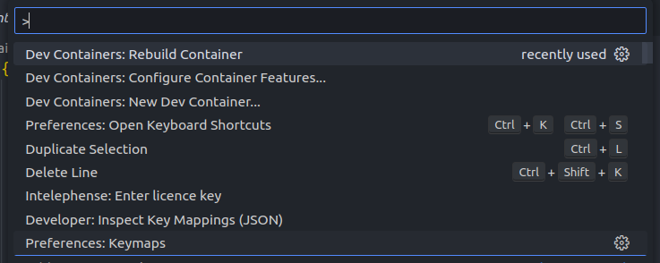
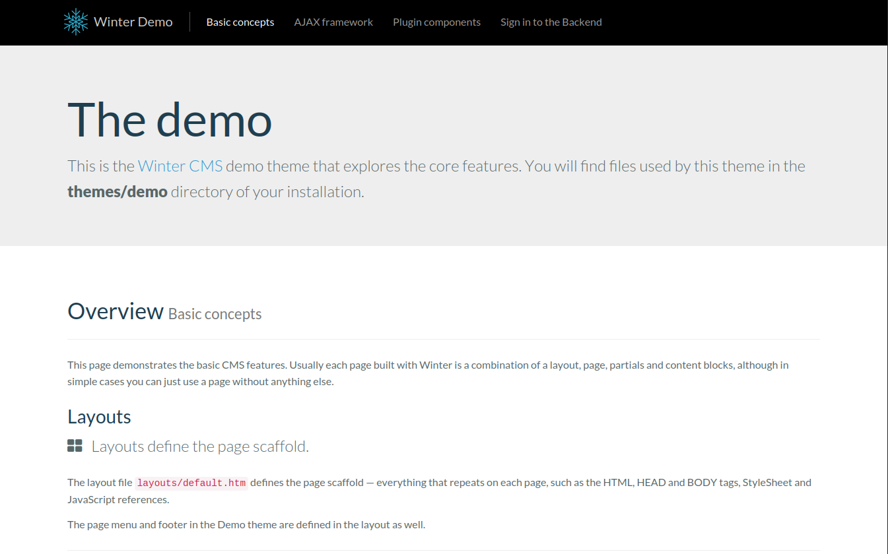
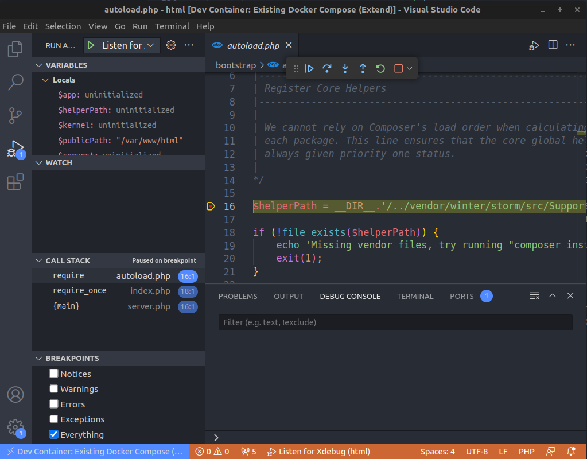

## Introduction

You're part of a team of talented developers working in different environments. You've chosen Linux but your colleagues are on MacOS or, even worse, Windows. You want your team to benefit from a powerful, standardized development environment with all the necessary dependencies.

Even if you're not working in a team, you may also want to separate your project from your local environment. Isolate it as much as possible so that you can come back to it later and find it just as you left it.

What you want is to develop without worrying about dependency problems!

We will use a tool called Laravel Sail - a command-line tool that should simplify the whole process and shield us from the complexities of such a setup.

This guide assumes that Docker is already installed on your machine. If not, go here:
- https://docs.docker.com/engine/install/

## Install WinterCMS

Start the stopwatch ⏱️

One command line (and you're almost done):
```bash
curl -s "https://winterbuild.vercel.app/api/laravelsail/example-app?with=mysql,redis&devcontainer" | bash
```

Since I want to use other components, not just Laravel itself, I'm specifying those in with query parameter. In particular, it's going to be MySql and Redis. The other query argument devcontainer instructs sail to create a default `devcontainer.json` file for us. Do not worry for now, if you don't know what is that - I will explain later.

Wait until is ready, it will take some time if this is the first time you do this process because is downloading all the images from Docker and the project dependencies (in case you have did this before, it won't take much longer).
```bash
cd example-app
```

A `.env` file has been preconfigured for Laravel Sail. You can change all variables except those defining hosts.

Let's start the web server:

```bash
./vendor/bin/sail up -d
```
This command starts the various services required by your application in the form of containers.

The other thing we want to do is to get `flynsarmy/wn-idehelper-plugin` package and instruct it to generate files that will hep the IntelliSense engine to provide accurate auto-completions for Laravel.
```bash
./vendor/bin/sail composer require --dev flynsarmy/wn-idehelper-plugin "dev-master"
```

> Since the web server runs seperately from your operating system, commands are called using `sail artisan` instead of `php artisan`.

Next, run this command to install Winter CMS :
```bash
./vendor/bin/sail artisan winter:up
```
> Save the password generated for the administrator.

You don't have time for a cup of coffee: your application is already ready at this address `http://localhost`!

## Configure VS Code development container

Open your working directory with VS Code : `code .`.

The IDE will immediately want to open this folder in a development container, since it has detected the `devcontainer.json` file. It will inform you with this message:


The Visual Studio Code Dev Containers extension lets you use a Docker container as a full-featured development environment. It allows you to open any folder or repository inside a container and take advantage of Visual Studio Code's full feature set.


The file `.devcontainer/devcontainer.json` instructs VS Code which container (or multiple containers) to open and what other customizations should perform. In this case, dockerComposeFile points to the docker-compose.yml generated by the Laravel Sail which specifies particular containers for our services (we wanted Mysql and Redis) and how they are connected. Since Laravel Sail is here to simplify this whole process, we will not worry about the content of docker-compose.yml and just trust that the sail did a good job.

Let's make slight changes to devcontainer.json. We will want to have full PHP support in the container.
```json
// https://aka.ms/devcontainer.json
{
  "name": "Existing Docker Compose (Extend)",
  "dockerComposeFile": ["../docker-compose.yml"],
  "service": "laravel.test",
  "workspaceFolder": "/var/www/html",
  "customizations": {
    "vscode": {
      "extensions": [
        "bmewburn.vscode-intelephense-client",
        "xdebug.php-debug",
        "wintercms.winter-cms"
        // "amiralizadeh9480.laravel-extra-intellisense",
        // "ryannaddy.laravel-artisan",
        // "onecentlin.laravel5-snippets",
        // "onecentlin.laravel-blade"
      ],
      "settings": {}
    }
  },
  "remoteUser": "sail",
  "postCreateCommand": "chown -R 1000:1000 /var/www/html"
  // "forwardPorts": [],
  // "runServices": [],
  // "shutdownAction": "none",
}
```
>You can read the whole documentation here : https://containers.dev/implementors/spec/

nce these changes have been made, press F1 and select `Rebuild Container` to rebuild the development container and install the extensions we've just added.



## Debugging WinterCMS inside the container

First, let's check that WinterCMS is running and accessible from the local machine. Open your favorite browser and type localhost. If you've changed the port with `APP_PORT`, use this port in the URL (e.g. `localhost:8080`).



It works !

### Enable Xdebug

Since we want to be able to debug php code in the container, we will need to turn that on.

Open `.env` file and append the following lines which will turn on Xdebug step debugging mode and instruct it to try to connect back to the VS Code on each request:
```env
SAIL_XDEBUG_MODE=debug
SAIL_XDEBUG_CONFIG="start_with_request=true"
```

>By default Laravel will be server from port 80. If you have already another web server installed localy which is bound to this port, the container will not start. You would need to either stop the local web server, or add `APP_PORT=8080` to `.env` file. That would change the port from where the Laravel will be served.

Restart all services for the environment change to take effect: :
```bash
./vendor/bin/sail up -d
```

### Configure VS Code debugger

Let's create our debugging configuration file `.vscode/launch.json`.
```json
{
    "version": "0.2.0",
    "configurations": [
        {
            "name": "Listen for Xdebug",
            "type": "php",
            "request": "launch",
            "port": 9003,
            "pathMappings": {
                "/var/www/html": "${workspaceFolder}"
            }
        }
    ]
}
```

Now go to your browser and install Xdebug extension:
- Chrome / Chromium : https://chrome.google.com/webstore/detail/xdebug-helper/eadndfjplgieldjbigjakmdgkmoaaaoc
- Firefox : https://addons.mozilla.org/en-US/firefox/addon/xdebug-helper-for-firefox/

Look up for the extension and click it, it will show a list and enable Debug, this will help us to send the signal  (a cookie) from our browser to your IDE to start the debugging when you visit a route.


And we are ready! We have our VS Code done with this config asnd ready to debug.

### Debug

One of the key features of Visual Studio Code is its great debugging support. VS Code's built-in debugger helps accelerate your edit, compile, and debug loop.

For example, set a breakpoint in the `bootstrap/autoload.php` file, then press `F5` to start debugging.



Then go to the application with your web browser to start the debugging session.

### Conclusion

That's it! You have successfully created and configured a standardized development environment for Laravel in Visual Studio Code on Docker.

## See more
- https://xdebug.org/docs/
- https://winterbuild.vercel.app/
- https://laravel.com/docs/10.x/sail
- https://wintercms.com/docs/setup/installation
- https://code.visualstudio.com/Docs/editor/debugging
- https://code.visualstudio.com/docs/devcontainers/create-dev-container