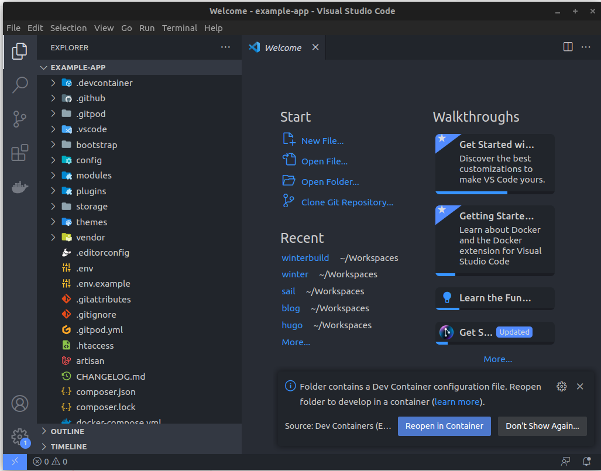
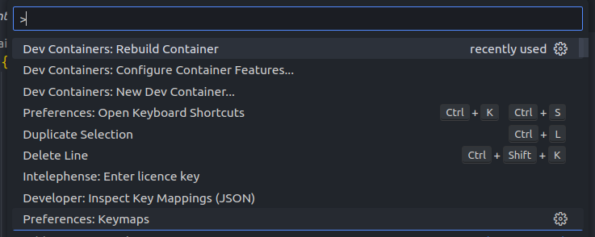
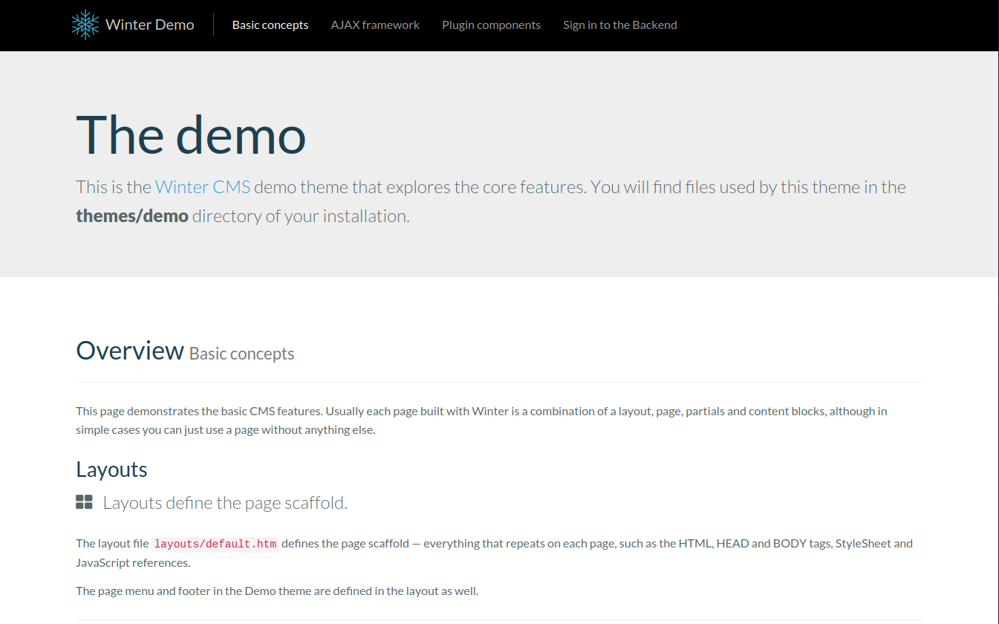
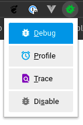
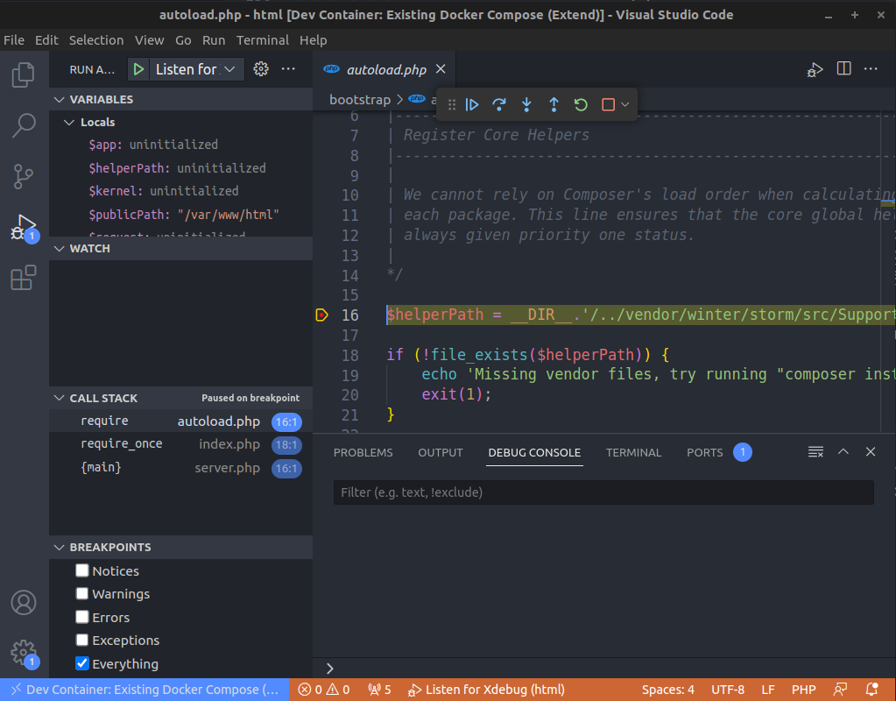

## Introduction

Vous faites partie d'une équipe de développeurs talentueux mais aux environnements différents. Vous avez choisi Linux mais vos collègues sont sur MacOS ou encore pire, Windows. Vous souhaitez que votre équipe puisse bénéficier d'un environnement de développement puissant mais surtout standardisé avec toutes les dépendances nécessaires.

Même si vous ne travaillez pas en équipe, vous voulez peut-être aussi séparer votre projet de votre environnement local. L'isoler au maximum afin de pouvoir revenir dessus plus tard et le retrouver tel que vous l'aviez laissé.

Ce que vous voulez c'est développer sans se soucier des problèmes de dépendances !

L'écosystème de Laravel propose différents environnements de développement comme Laravel Homestead, Laravel Valet et Laravel Sail. Ce dernier nous donne un environnement utilisant Docker et donc compatible avec tous les systèmes. Il s'agit d'un excellent point de départ pour construire une application WinterCMS utilisant PHP, MySQL et Redis sans avoir besoin d'une expérience préalable de Docker. C'est simple, rapide et efficace.

Ce guide suppose que Docker est déjà installé sur votre machine, si ce n'est pas le cas rendez-vous ici :
- https://docs.docker.com/engine/install/

## Installer WinterCMS

Lancez le chronomètre ⏱️

Une ligne de commande (et c'est presque fini) :

```bash
curl -s "https://winterbuild.vercel.app/api/laravelsail/example-app?with=mysql,redis&devcontainer" | bash
```

Comme je veux utiliser d'autres composants, et pas seulement WinterCMS, je les spécifie dans le paramètre `with` de la requête. Ici nous installerons MySql et Redis. L'autre argument de la requête, `devcontainer`, demande à `sail` de créer un fichier `devcontainer.json` par défaut pour nous.

Ne vous inquiétez pas si vous ne savez pas ce que c'est, je vous expliquerai plus tard.

Attendez que ce soit prêt, cela prendra un peu de temps si c'est la première fois que vous faites ce processus car il télécharge toutes les images de Docker et les dépendances du projet (si vous l'avez déjà fait auparavant, cela ne prendra pas beaucoup plus de temps).
```bash
cd example-app
```

Un fichier `.env` a été préconfiguré pour Laravel Sail. Vous pouvez changer toutes les variables sauf celles qui définissent les hôtes.

Démarrons maintenant le serveur web :

```bash
./vendor/bin/sail up -d
```
Cette commande démarrera les différents services nécessaires à votre application sous forme de conteneurs.

L’autre chose que nous voulons faire est d’installer le plugin `flynsarmy/wn-idehelper-plugin`. Ce plugin générera des fichiers qui aideront le moteur IntelliSense à fournir des auto-complétions précises pour WinterCMS.

```bash
./vendor/bin/sail composer require --dev flynsarmy/wn-idehelper-plugin "dev-master"
```

Enfin la dernière étape consiste à hydrater la base de données WinterCMS :

```bash
./vendor/bin/sail artisan winter:up
```
> Notez bien le mot de passe généré pour l'administrateur.

Vous n'avez pas le temps de boire un café : votre application est déjà prête à cette adresse `http://localhost`!

## Configurer VS Code

Ouvrez votre répertoire de travail avec VS Code : `code .`.

L'IDE va immédiatement vouloir ouvrir ce dossier dans un conteneur de développement puisqu'il a détecté le fichier `devcontainer.json`. Il vous en informera par ce message :



Une des fonctionnalités les plus intéressantes de VS Code est la possibilité de travailler dans des conteneurs de développement. En effet, grâce à l'extension *Visual Studio Code Dev Containers* vous pouvez utiliser un conteneur Docker comme environnement de développement complet. Elle vous permet d'ouvrir n'importe quel dossier ou dépôt à l'intérieur d'un conteneur et de tirer parti de l'ensemble des fonctionnalités de Visual Studio Code.


Le fichier `.devcontainer/devcontainer.json` indique à VS Code quel conteneur(s) ouvrir et quelles personnalisations doivent être appliquées. Laravel Sail nous a gentiment généré ce fichier mais nous allons faire quelques changements pour obtenir un meilleur support PHP dans le conteneur. Ajoutez ces 3 extensions :
```json
// https://aka.ms/devcontainer.json
{
  "name": "Existing Docker Compose (Extend)",
  "dockerComposeFile": ["../docker-compose.yml"],
  "service": "laravel.test",
  "workspaceFolder": "/var/www/html",
  "customizations": {
    "vscode": {
      "extensions": [
        "bmewburn.vscode-intelephense-client",
        "xdebug.php-debug",
        "wintercms.winter-cms"
        // "amiralizadeh9480.laravel-extra-intellisense",
        // "ryannaddy.laravel-artisan",
        // "onecentlin.laravel5-snippets",
        // "onecentlin.laravel-blade"
      ],
      "settings": {}
    }
  },
  "remoteUser": "sail",
  "postCreateCommand": "chown -R 1000:1000 /var/www/html"
  // "forwardPorts": [],
  // "runServices": [],
  // "shutdownAction": "none",
}
```

> Vous pouvez retrouver la spécification complète ici : https://containers.dev/implementors/spec/

Une fois ces modification effectuées, appuyez sur F1 et sélectionnez `Rebuild Container` pour reconstruire le conteneur de développement et installer les extensions que nous venons d'ajouter.



## Déboguer WinterCMS dans le conteneur

Tout d'abord, vérifions que WinterCMS fonctionne et est accessible depuis la machine locale. Ouvrez votre navigateur préféré et tapez localhost. Si vous avez modifié le port avec `APP_PORT`, utilisez ce port dans l'URL (par exemple, localhost:8080).



Ça fonctionne !

### Activer Xdebug

Laravel Sail est livré par défaut avec le support de Xdebug. Xdebug est un débogueur populaire et puissant pour PHP.

Puisque nous voulons être en mesure de déboguer le code PHP dans le conteneur, nous allons devoir l'activer.

Ouvrez le fichier .env et ajoutez les lignes suivantes qui activeront le mode de débogage par étapes de Xdebug et lui demanderont d'essayer de se connecter à VS Code à chaque requête :

```env
SAIL_XDEBUG_MODE=debug
SAIL_XDEBUG_CONFIG="start_with_request=true"
```

> Par défaut WinterCMS utilise le port 80. Si vous avez déjà un autre serveur web installé localcalement qui est lié à ce port, le conteneur ne démarrera pas. Vous devrez soit arrêter le serveur web local, soit ajouter `APP_PORT=8080` au fichier `.env`.

Redémarrez ensuite tous les services pour que la modification d'environnement soit effective :
```bash
./vendor/bin/sail up -d
```

### Configurer le débogueur VS Code

Créons notre fichier de configuration pour le déboguage `.vscode/launch.json`.
```json
{
    "version": "0.2.0",
    "configurations": [
        {
            "name": "Listen for Xdebug",
            "type": "php",
            "request": "launch",
            "port": 9003,
            "pathMappings": {
                "/var/www/html": "${workspaceFolder}"
            }
        }
    ]
}
```

Maintenant allez dans votre navigateur et installer l'extension Xdebug :
- Chrome / Chromium : https://chrome.google.com/webstore/detail/xdebug-helper/eadndfjplgieldjbigjakmdgkmoaaaoc
- Firefox : https://addons.mozilla.org/en-US/firefox/addon/xdebug-helper-for-firefox/

Recherchez l'extension et cliquez dessus, elle affichera une liste et activera Xdebug, ce qui nous aidera à envoyer le signal de notre navigateur à votre IDE pour démarrer le débogage lorsque vous visitez une route (un cookie).



Et nous sommes prêts ! Notre IDE est configuré et prêt à déboguer du code.

### Déboguer

L'une des principales caractéristiques de Visual Studio Code est son excellent support de débogage. Le débogueur intégré de VS Code permet d'améliorer votre productivité : éditez, compilez et déboguer.

Placez par exemple un point d'arrêt dans le fichier `bootstrap/autoload.php` puis appuyez sur `F5` pour lancer le déboguage.



Rendez-vous ensuite sur l'application avec votre navigateur web pour déclencher la session de déboguage.

## Conclusion

Bravo, vous avez réussi à créer et à configurer un environnement de développement standardisé pour WinterCMS dans Visual Studio Code sur Docker.

## En savoir plus
- https://xdebug.org/docs/
- https://winterbuild.vercel.app/
- https://laravel.com/docs/10.x/sail
- https://wintercms.com/docs/setup/installation
- https://code.visualstudio.com/Docs/editor/debugging
- https://code.visualstudio.com/docs/devcontainers/create-dev-container