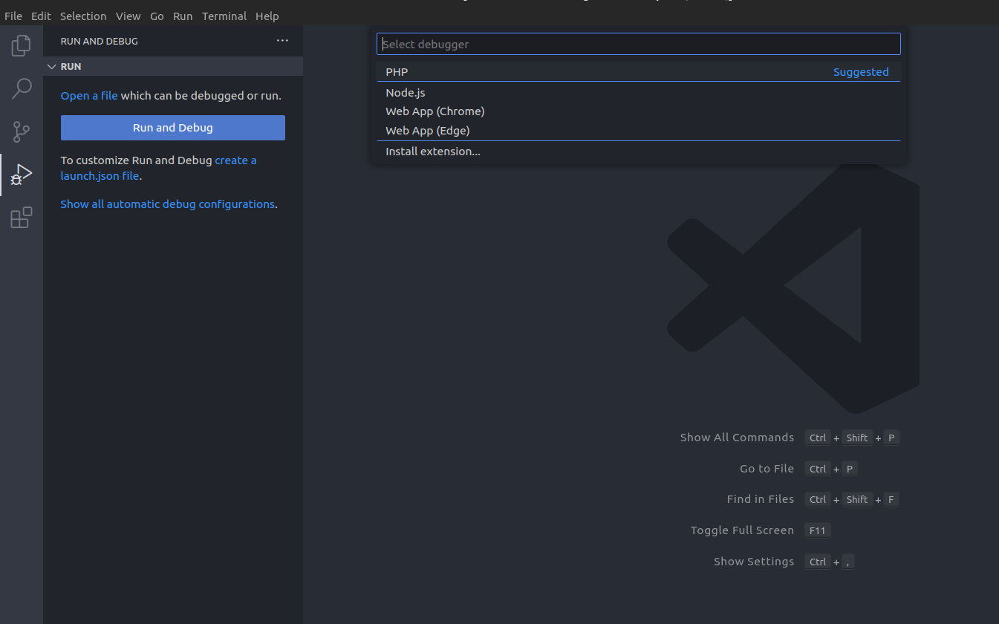

# Introduction

Imaginez que vous fassiez partie d'une équipe et que vous souhaitiez que chaque membre développe dans un environnement standardisé. Ils peuvent avoir des systèmes d'exploitation différents et utiliser des outils de développement ou des IDE différents, mais vous voulez avoir un environnement unifié avec toutes les dépendances nécessaires.

Même si vous ne travaillez pas en équipe, vous voulez séparer le projet de votre environnement local. L'isoler au maximum. Cela ne vous est jamais arrivé de vouloir reprendre le travail sur un ancien projet tel que vous l'aviez laissé ? Commencer à coder sans se soucier des problèmes d'environnement, même si vous changez d'ordinateur.

Ce rêve est tout à fait réalisable ! Pour cela nous utiliserons un outil appelé Laravel Sail. Il s'agit d'un excellent point de départ pour construire une application WinterCMS utilisant PHP, MySQL et Redis sans avoir besoin d'une expérience préalable de Docker.

# Installer WinterCMS

Lancez le chronomètre ⏱️

Une ligne de commande (et c'est presque fini) :

```bash
curl -s "https://winterbuild.vercel.app/api/laravelsail/example-app?with=mysql,redis&devcontainer" | bash
```

Comme je veux utiliser d'autres composants, et pas seulement WinterCMS, je les spécifie dans le paramètre `with` de la requête. Ici nous installerons MySql et Redis. L'autre argument de la requête, `devcontainer`, demande à `sail` de créer un fichier `devcontainer.json` par défaut pour nous.

Ne vous inquiétez pas pour l'instant, si vous ne savez pas ce que c'est - je vous expliquerai plus tard.

Lorsque le script se termine, rendez vous dans le nouveau répertoire :

```bash
cd example-app
```

> Un fichier `.env` a été préconfiguré pour Laravel Sail. Vous pouvez changer toutes les variables sauf celles qui définissent les hôtes.

Pour démarrer le serveur web, rien de plus simple :

```bash
./vendor/bin/sail up -d
```

> Cette commande démarrera les différents services nécessaires à votre application sous forme de conteneurs.

Enfin la dernière étape consiste à hydrater la base de données WinterCMS :

```bash
./vendor/bin/sail artisan winter:up
```

> Notez bien le mot de passe généré pour l'administrateur.

Vous n'avez pas le temps de boire un café : votre application est déjà prête à cette adresse `http://localhost`!

# Configurer VS Code

Là aussi, l'opération est rapide :

```
code .
```

VS Code va immédiatement vouloir rouvrir ce dossier dans un conteneur de développement puisqu'il a détecté le fichier `devcontainer.json`. Il vous en informera par ce message :


# Personnaliser le conteneur de développement

L'extension Visual Studio Code Dev Containers vous permet d'utiliser un conteneur Docker comme environnement de développement complet. Elle vous permet d'ouvrir n'importe quel dossier ou dépôt à l'intérieur d'un conteneur et de tirer parti de l'ensemble des fonctionnalités de Visual Studio Code.


Le fichier `devcontainer.json` indique à VS Code quel conteneur(s) ouvrir et quelles personnalisations doivent être appliquées. Laravel Sail nous a gentiment généré ce fichier mais nous allons faire quelques changements pour obtenir un meilleur support PHP dans le conteneur.

```json
// https://aka.ms/devcontainer.json
{
  "name": "Existing Docker Compose (Extend)",
  "dockerComposeFile": ["../docker-compose.yml"],
  "service": "laravel.test",
  "workspaceFolder": "/var/www/html",
  "customizations": {
    "vscode": {
      "extensions": [
        "bmewburn.vscode-intelephense-client",
        "xdebug.php-debug",
        "wintercms.winter-cms"
        // "amiralizadeh9480.laravel-extra-intellisense",
        // "ryannaddy.laravel-artisan",
        // "onecentlin.laravel5-snippets",
        // "onecentlin.laravel-blade"
      ],
      "settings": {}
    }
  },
  "remoteUser": "sail",
  "postCreateCommand": "chown -R 1000:1000 /var/www/html"
  // "forwardPorts": [],
  // "runServices": [],
  // "shutdownAction": "none",
}
```

> Vous pouvez retrouver la spécification complète ici : https://containers.dev/implementors/spec/

L'autre chose que nous voulons faire est d'installer le paquet `barryvdh/laravel-ide-helper` et de lui demander de générer des fichiers qui aideront le moteur IntelliSense à fournir des auto-complétions précises pour WinterCMS.

Tout d'abord, ouvrez `composer.json` et mettez à jour `post-update-cmd` en ajoutant ces commandes :

```json
{
  "scripts": {
    "post-update-cmd": [
      "@php artisan ide-helper:generate",
      "@php artisan ide-helper:models",
      "@php artisan ide-helper:meta"
    ]
  }
}
```

Ces commandes généreront des fichiers pour aider VS Code à autocompléter le code à chaque fois que vous mettrez à jour vos dépendances. Lancer ensuite la commande suivante pour installer le paquet :
```bash
./vendor/bin/sail composer require --dev flynsarmy/wn-idehelper-plugin "dev-master"
```

Une fois ces modification effectuées, appuyez sur F1 et sélectionnez `Rebuild Container` pour reconstruire le conteneur de développement et installer les extensions que nous venons d'ajouter.


# Activer Xdebug

Laravel Sail est livré par défaut avec le support de Xdebug. Xdebug est un débogueur populaire et puissant pour PHP.

Puisque nous voulons être en mesure de déboguer le code PHP dans le conteneur, nous allons devoir l'activer.

Ouvrez le fichier .env et ajoutez les lignes suivantes qui activeront le mode de débogage par étapes de Xdebug et lui demanderont d'essayer de se connecter à VS Code à chaque requête :

```env
SAIL_XDEBUG_MODE=debug
SAIL_XDEBUG_CONFIG="start_with_request=true"
```

> Par défaut WinterCMS utilise le port 80. Si vous avez déjà un autre serveur web installé localcalement qui est lié à ce port, le conteneur ne démarrera pas. Vous devrez soit arrêter le serveur web local, soit ajouter `APP_PORT=8080` au fichier `.env`.

Redémarrez ensuite tous les services pour que la modification d'environnement soit effective :

```bash
./vendor/bin/sail up -d
```

# Déboguer WinterCMS dans le conteneur

Tout d'abord, vérifions que WinterCMS fonctionne et est accessible depuis la machine locale. Ouvrez votre navigateur préféré et tapez localhost. Si vous avez modifié le port avec `APP_PORT`, utilisez ce port dans l'URL (par exemple, localhost:8080).


Parfait !

Pour configurer notre environnement de débogage, sélectionnez la vue de débogage sur le côté gauche, puis cliquez sur le lien `Show all automatic debug configurations` puis selectionnez `Add configuration` puis `PHP` dans le menu déroulant qui apparaît, comme le montre l'image ci-dessous.



Un nouveau fichier a été créé : `.vscode/launch.json` valide. Il s'agit de la configuration de déboguage VS Code.
```json
{
    "version": "0.2.0",
    "configurations": [
        {
            "name": "Listen for Xdebug",
            "type": "php",
            "request": "launch",
            "port": 9003,
            "pathMappings": {
                "/var/www/html": "${workspaceFolder}"
            }
        }
    ]
}
```